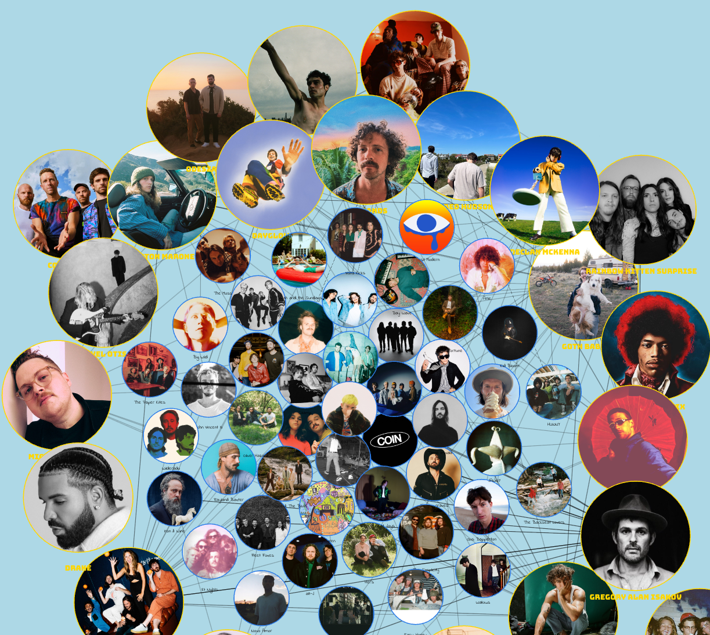

# Spotify Graph Visualizer

Using the Spotify API this grabs your top 25 artists, and grabs recommended artists between them all, and maps the common connections in a playful graph.

### To Run

1. Create a .env file with CLIENT_ID set to your Spotify App's Client ID and CLIENT_SECRET with the corresponding secret. (These are free to make [here](https://developer.spotify.com/dashboard) by the way)

2. Start the frontend with `npm start`

3. Start the backend with `node server/server.js`

Enjoy!

